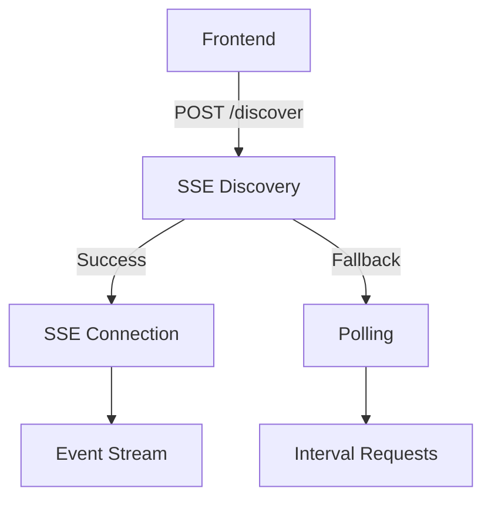
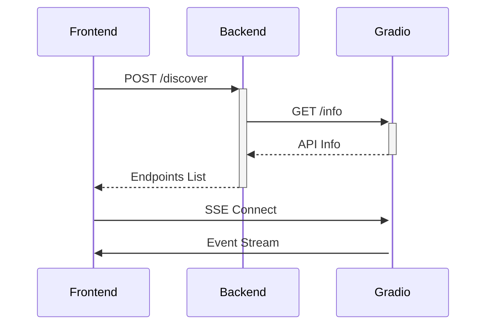

# Server-Sent Events (SSE) Integration

## Overview
This document describes the experimental SSE implementation for real-time Gradio API interactions.



## File Structure
```
src/experimental/sse-handler/
├── route.ts         # API endpoints
├── client.ts        # Frontend utilities
├── utils.ts         # Shared functions
└── types.ts         # Type definitions
```

## API Reference

### Discovery Endpoint
`POST /api/experimental/sse/discover`

**Request:**
```typescript
interface DiscoverRequest {
  baseUrl: string;  // Gradio app URL
}
```

**Response:**
```typescript
interface DiscoverResponse {
  success: boolean;
  supportsSSE: boolean;
  endpoints: string[];
  error?: string;
}
```

### SSE Client API

```typescript
class SSEClient {
  constructor(url: string);
  
  // Connect to SSE stream
  connect(): Promise<EventSource>;
  
  // Process messages
  onMessage(callback: (data: SSEMessage) => void): void;
  
  // Error handling  
  onError(callback: (error: Error) => void): void;
}
```

## Implementation Details

### Sequence Diagram


### Error Handling
1. **Discovery Failure**:
   - Retry with `/gradio_api/info`
   - Fallback to polling if both fail

2. **Connection Issues**:
   ```javascript
   eventSource.onerror = () => {
     if (eventSource.readyState === EventSource.CLOSED) {
       startPollingFallback();
     }
   };
   ```

## Usage Example

### Frontend Implementation
```typescript
import { discoverSSE, SSEClient } from '@/experimental/sse-handler/client';

async function runProcess() {
  const discovery = await discoverSSE('https://app.hf.space');
  
  if (discovery.supportsSSE) {
    const client = new SSEClient(discovery.endpoints[0]);
    client.onMessage((data) => {
      console.log('Update:', data);
    });
    await client.connect();
  } else {
    // Fallback to polling
  }
}
```

## Testing

### Test Cases
1. **Discovery Test**:
   ```javascript
   test('discovers SSE endpoints', async () => {
     const result = await discoverSSE(validUrl);
     expect(result.supportsSSE).toBeTruthy();
   });
   ```

2. **Connection Test**:
   ```javascript
   test('handles SSE connection', async () => {
     const client = new SSEClient(testUrl);
     const mockCallback = jest.fn();
     client.onMessage(mockCallback);
     await client.connect();
     expect(mockCallback).toHaveBeenCalled();
   });
   ```

## Migration Guide

### Enabling in Production
1. Set feature flag in `.env`:
   ```
   USE_SSE_EXPERIMENTAL=true
   ```
2. Update API routes to include SSE handlers
3. Deploy with monitoring
