# 🚀 FAL Integration Plan - Dynamic AI App Platform

> **Objective**: Integrate FAL.ai as a third provider alongside Gradio and Replicate, with proper polling support for Vercel serverless functions.

---

## 📋 Table of Contents

- [🎯 Project Overview](#-project-overview)
- [🔄 Current Architecture Analysis](#-current-architecture-analysis)
- [🚀 FAL Integration Strategy](#-fal-integration-strategy)
- [📊 Implementation Phases](#-implementation-phases)
- [🛠️ Technical Implementation Details](#️-technical-implementation-details)
- [🧪 Testing Strategy](#-testing-strategy)
- [📈 Success Criteria](#-success-criteria)

---

## 🎯 Project Overview

### **Current State**
- Dynamic AI app generation platform with Next.js
- Supports **Gradio** (direct API calls) and **Replicate** (polling-based)
- Configuration-driven UI system with MongoDB persistence
- Dynamic `/api/app/[slug]` route for execution

### **Goal**
Add **FAL.ai** as a third provider with:
- ✅ Queue-based polling mechanism (like j4Studio example)
- ✅ OpenAPI schema auto-discovery
- ✅ Seamless integration with existing create flow
- ✅ Vercel serverless compatibility

### **Key Benefits**
- 🎯 Access to FAL's advanced models (video generation, image editing)
- 🔄 Robust polling system for long-running tasks
- 📈 Expanded model ecosystem for users
- 🛡️ Serverless-friendly architecture

---

## 🔄 Current Architecture Analysis

### **Provider Support Pattern**

```mermaid
flowchart TD
    A["🎯 Configuration Object"] --> B{"Provider Type"}
    B -->|gradio| C["📡 Direct API Call"]
    B -->|replicate| D["🔄 Polling via SDK"]
    B -->|fal| E["🚀 Queue + Custom Polling"]
    
    C --> F["⚡ Immediate Response"]
    D --> G["🔄 Prediction ID + Poll"]
    E --> H["📋 Request ID + Custom Poll"]
    
    style E fill:#e8f5e8
    style H fill:#fff3e0
```


### **Current Create Flow**
1. **Provider Selection**: User chooses gradio/replicate
2. **Schema Fetching**: Auto-discover inputs/outputs
3. **Configuration**: Form/JSON/Preview editing
4. **Persistence**: Save to MongoDB
5. **Execution**: Dynamic route handles provider logic

---

## 🚀 FAL Integration Strategy

### **Polling Architecture (Based on j4Studio)**

```mermaid
sequenceDiagram
    participant F as 🖥️ Frontend
    participant API as 🔧 API Route
    participant FAL as 🤖 FAL Queue
    
    F->>+API: POST /api/app/[slug] (FAL job)
    API->>+FAL: fal.queue.submit(endpoint_id, input)
    FAL-->>-API: {request_id, status: "QUEUED"}
    API-->>-F: {request_id, provider: "fal"}
    
    loop Every 5 seconds
        F->>+API: GET /api/fal/status/[requestId]
        API->>+FAL: fal.queue.status(endpoint_id, requestId)
        FAL-->>-API: {status, progress, logs}
        API-->>-F: Status update
        
        alt Status = COMPLETED
            F->>+API: GET /api/fal/result/[requestId]
            API->>+FAL: fal.queue.result(endpoint_id, requestId)
            FAL-->>-API: Final output data
            API-->>-F: Display results
        end
    end
```


### **Core Principles**
- 🔄 **Client-side polling** to avoid serverless timeouts
- 📡 **Separate status/result endpoints** for efficiency
- 🛡️ **Proper cleanup** and error handling
- 🎯 **Consistent UX** with existing providers

---

## 📊 Implementation Phases

### **Phase 1: Foundation & Types** 
**Duration**: 1-2 hours

- [x] **Extend type system** to support 'fal' provider
  - [x] Update `Configuration` type in `src/types/index.ts`
  - [x] Add FAL-specific fields: `endpoint_id`, `fal_endpoint`
- [x] **Create FAL client utilities**
  - [x] Create `src/lib/fal-client.ts` with queue operations
  - [x] Add schema fetching functions
  - [x] Add polling helper functions
- [ ] **Install dependencies**
  - [ ] Add `@fal-ai/client` to package.json (if not using fetch)
  - [ ] Update environment variables for FAL_KEY

**Acceptance Criteria**: ✅ Types compile, FAL client utilities work

---

### **Phase 2: Polling Infrastructure**
**Duration**: 2-3 hours

- [x] **Create status endpoint** 
  - [x] Create `src/app/api/fal/status/[requestId]/route.ts`
  - [x] Implement `fal.queue.status()` calls
  - [x] Return progress, logs, queue position
  - [x] Handle authentication and error cases
- [x] **Create result endpoint**
  - [x] Create `src/app/api/fal/result/[requestId]/route.ts`
  - [x] Implement `fal.queue.result()` calls
  - [x] Return final output data
  - [x] Handle completed job retrieval
- [ ] **Add polling utilities**
  - [ ] Create polling hooks/functions
  - [ ] Add cleanup mechanisms
  - [ ] Add error handling and retries

**Acceptance Criteria**: ✅ Polling endpoints return proper data, no memory leaks

---

### **Phase 3: Create Page Integration** ✅
**Duration**: 2-3 hours

- [x] **Add FAL provider option**
  - [x] Update provider dropdown in `src/app/create/page.tsx`
  - [x] Add 'fal' option alongside 'gradio'/'replicate'
- [x] **Add FAL-specific input fields**
  - [x] Add `endpoint_id` input field (e.g., "fal-ai/wan-vace-14b/reframe")
  - [x] Show/hide fields based on provider selection
- [x] **Extend schema fetching**
  - [x] Update `src/app/api/create/fetch-model-details/route.ts`
  - [x] Add FAL OpenAPI schema fetching logic
  - [x] Parse schema to generate inputs/outputs
  - [x] Handle component mapping (video_url → image, etc.)

**Acceptance Criteria**: ✅ Can select FAL, fetch schemas, generate configurations

---

### **Phase 4: Dynamic Route Updates**
**Duration**: 1-2 hours

- [ ] **Extend main execution route**
  - [ ] Update `src/app/api/app/[slug]/route.ts`
  - [ ] Add FAL provider handling logic
  - [ ] Implement `fal.queue.submit()` calls
  - [ ] Return request_id and provider info
- [ ] **Handle input processing**
  - [ ] Map configuration inputs to FAL format
  - [ ] Handle file uploads and data types
  - [ ] Validate required parameters

**Acceptance Criteria**: ✅ FAL jobs submit successfully, return request_id

---

### **Phase 5: Frontend Polling Integration**
**Duration**: 2-3 hours

- [ ] **Update ClientPage component**
  - [ ] Add polling state management to `src/app/app/[slug]/ClientPage.tsx`
  - [ ] Implement polling intervals and cleanup
  - [ ] Add status display (queued, progress, completed)
  - [ ] Handle error states and recovery
- [ ] **Update UI components**
  - [ ] Show polling progress in output section
  - [ ] Add loading states and queue position
  - [ ] Display logs and status updates
- [ ] **Integrate with AppPreview**
  - [ ] Update `src/components/AppPreview.tsx` for FAL polling
  - [ ] Handle preview mode testing

**Acceptance Criteria**: ✅ Smooth polling UX, proper status updates, no memory leaks

---

### **Phase 6: Configuration & Testing**
**Duration**: 1-2 hours

- [ ] **Add sample FAL configurations**
  - [ ] Add wan-vace-reframe example to `src/common/configuration.ts`
  - [ ] Add other popular FAL models
  - [ ] Test configuration generation
- [ ] **End-to-end testing**
  - [ ] Test create flow with FAL provider
  - [ ] Test job submission and polling
  - [ ] Test error handling and edge cases
  - [ ] Verify memory cleanup and performance

**Acceptance Criteria**: ✅ Complete FAL integration working end-to-end

---

## 🛠️ Technical Implementation Details

### **1. Type System Extensions**

```typescript
// src/types/index.ts
export type Configuration = {
  name: string;
  type: 'gradio' | 'replicate' | 'fal'; // ✅ Add 'fal'
  client?: string;
  path?: string;
  endpoint?: string;
  model?: `${string}/${string}` | `${string}/${string}:${string}`;
  version?: string | null;
  // FAL-specific fields
  endpoint_id?: string;  // e.g., "fal-ai/wan-vace-14b/reframe"
  fal_endpoint?: string; // FAL base URL (default: https://queue.fal.run)
  inputs: InputItem[];
  outputs?: OutputItem[];
};
```

### **2. FAL Client Utilities**

```typescript
// src/lib/fal-client.ts
export class FalClient {
  private apiKey: string;
  private baseUrl = 'https://queue.fal.run';

  async fetchSchema(endpoint_id: string) {
    const url = `https://fal.ai/api/openapi/queue/openapi.json?endpoint_id=${endpoint_id}`;
    const response = await fetch(url);
    return response.json();
  }

  async submitJob(endpoint_id: string, input: any) {
    const response = await fetch(`${this.baseUrl}/${endpoint_id}`, {
      method: 'POST',
      headers: {
        'Authorization': `Key ${this.apiKey}`,
        'Content-Type': 'application/json'
      },
      body: JSON.stringify(input)
    });
    return response.json(); // Returns { request_id, status_url, etc. }
  }

  async checkStatus(endpoint_id: string, request_id: string) {
    const response = await fetch(
      `${this.baseUrl}/${endpoint_id}/requests/${request_id}/status`,
      {
        headers: { 'Authorization': `Key ${this.apiKey}` }
      }
    );
    return response.json();
  }

  async getResult(endpoint_id: string, request_id: string) {
    const response = await fetch(
      `${this.baseUrl}/${endpoint_id}/requests/${request_id}`,
      {
        headers: { 'Authorization': `Key ${this.apiKey}` }
      }
    );
    return response.json();
  }
}
```

### **3. Polling Endpoints**

```typescript
// src/app/api/fal/status/[requestId]/route.ts
export async function GET(
  request: NextRequest,
  { params }: { params: { requestId: string } }
) {
  try {
    const { requestId } = params;
    const endpoint_id = request.nextUrl.searchParams.get('endpoint_id');
    
    if (!endpoint_id) {
      return NextResponse.json({ error: 'endpoint_id required' }, { status: 400 });
    }

    const falClient = new FalClient();
    const status = await falClient.checkStatus(endpoint_id, requestId);

    return NextResponse.json({
      requestId,
      status: status.status, // "IN_QUEUE", "IN_PROGRESS", "COMPLETED", "FAILED"
      logs: status.logs || [],
      progress: status.progress?.percentage || 0,
      queue_position: status.queue_position,
      endpoint_id
    });

  } catch (error: any) {
    console.error('Error checking FAL status:', error);
    return NextResponse.json({ error: error.message }, { status: 500 });
  }
}
```

### **4. Frontend Polling Logic**

```typescript
// In src/app/app/[slug]/ClientPage.tsx
const [currentJobId, setCurrentJobId] = useState<string | null>(null);
const [jobStatus, setJobStatus] = useState<string>('IDLE');
const [pollingInterval, setPollingInterval] = useState<NodeJS.Timeout | null>(null);
const [queuePosition, setQueuePosition] = useState<number | null>(null);
const [progress, setProgress] = useState<number>(0);

const startPolling = (requestId: string, endpoint_id: string) => {
  if (pollingInterval) clearInterval(pollingInterval);
  
  setCurrentJobId(requestId);
  setJobStatus('POLLING');

  const interval = setInterval(async () => {
    try {
      const statusResponse = await fetch(
        `/api/fal/status/${requestId}?endpoint_id=${endpoint_id}`
      );
      
      if (!statusResponse.ok) {
        throw new Error('Failed to get status');
      }
      
      const statusData = await statusResponse.json();
      
      setJobStatus(statusData.status);
      setQueuePosition(statusData.queue_position);
      setProgress(statusData.progress || 0);
      
      if (statusData.status === 'COMPLETED') {
        stopPolling();
        
        // Fetch final result
        const resultResponse = await fetch(
          `/api/fal/result/${requestId}?endpoint_id=${endpoint_id}`
        );
        
        if (resultResponse.ok) {
          const resultData = await resultResponse.json();
          setOutputs(resultData.data); // Display results
          setJobStatus('COMPLETED');
        } else {
          setError('Failed to fetch result');
        }
      } else if (statusData.status === 'FAILED') {
        setError('Job processing failed');
        stopPolling();
      }
    } catch (error) {
      console.error('Polling error:', error);
      setError('Polling error occurred');
      stopPolling();
    }
  }, 5000); // Poll every 5 seconds
  
  setPollingInterval(interval);
};

const stopPolling = () => {
  if (pollingInterval) {
    clearInterval(pollingInterval);
    setPollingInterval(null);
  }
  setCurrentJobId(null);
  setJobStatus('IDLE');
  setQueuePosition(null);
  setProgress(0);
};

// Cleanup on unmount
useEffect(() => {
  return () => {
    if (pollingInterval) {
      clearInterval(pollingInterval);
    }
  };
}, [pollingInterval]);
```

### **5. Schema Parsing Logic**

```typescript
// In src/app/api/create/fetch-model-details/route.ts
if (type === 'fal') {
  const { endpoint_id } = body;
  
  // Fetch OpenAPI schema
  const schemaUrl = `https://fal.ai/api/openapi/queue/openapi.json?endpoint_id=${endpoint_id}`;
  const schemaResponse = await fetch(schemaUrl);
  const schema = await schemaResponse.json();
  
  // Parse input schema
  const inputSchemaKey = Object.keys(schema.components.schemas).find(key => 
    key.toLowerCase().includes('input')
  );
  const outputSchemaKey = Object.keys(schema.components.schemas).find(key => 
    key.toLowerCase().includes('output') || key.toLowerCase().includes('response')
  );
  
  if (!inputSchemaKey || !outputSchemaKey) {
    throw new Error('Could not find input/output schemas');
  }
  
  const inputSchema = schema.components.schemas[inputSchemaKey];
  const outputSchema = schema.components.schemas[outputSchemaKey];
  
  // Convert to InputItem[] and OutputItem[]
  const inputs: InputItem[] = Object.entries(inputSchema.properties || {}).map(
    ([key, prop]: [string, any]) => ({
      component: mapTypeToComponent(prop.type, key),
      key,
      type: mapOpenAPITypeToType(prop.type),
      value: prop.default || null,
      show: !inputSchema.required?.includes(key), // Show non-required fields
      placeholder: prop.description || '',
      label: prop.title || key,
      required: inputSchema.required?.includes(key) || false
    })
  );
  
  const outputs: OutputItem[] = Object.entries(outputSchema.properties || {}).map(
    ([key, prop]: [string, any]) => ({
      component: mapTypeToComponent(prop.type, key),
      key,
      type: mapOpenAPITypeToType(prop.type),
      show: true,
      title: prop.title || key,
      placeholder: prop.description || ''
    })
  );
  
  return NextResponse.json({
    endpoint_id,
    inputs,
    outputs,
    schema: { input: inputSchema, output: outputSchema }
  });
}

// Helper functions
function mapTypeToComponent(type: string, key: string): InputItem['component'] {
  if (key.includes('image') || key.includes('video_url')) return 'image';
  if (key.includes('audio')) return 'audio';
  if (type === 'boolean') return 'checkbox';
  if (type === 'number' || type === 'integer') return 'number';
  return 'prompt';
}

function mapOpenAPITypeToType(type: string): InputItem['type'] {
  if (type === 'boolean') return 'boolean';
  if (type === 'number' || type === 'integer') return 'integer';
  if (type === 'array') return 'array';
  return 'string';
}
```

### **6. Sample FAL Configuration**

```typescript
// src/common/configuration.ts - Add to configurationsObj array
{
  name: 'wan-vace-reframe',
  type: 'fal',
  endpoint_id: 'fal-ai/wan-vace-14b/reframe',
  fal_endpoint: 'https://queue.fal.run',
  inputs: [
    { 
      component: 'prompt', 
      type: 'string', 
      key: 'prompt', 
      value: '', 
      show: true,
      label: 'Prompt',
      placeholder: 'The text prompt to guide video generation'
    },
    { 
      component: 'image', 
      type: 'string', 
      key: 'video_url', 
      value: null, 
      show: true,
      label: 'Source Video',
      placeholder: 'URL to the source video file',
      required: true
    },
    { 
      component: 'dropdown', 
      type: 'string', 
      key: 'aspect_ratio', 
      value: 'auto', 
      show: true,
      label: 'Aspect Ratio',
      options: ['auto', '16:9', '9:16']
    },
    { 
      component: 'number', 
      type: 'integer', 
      key: 'num_inference_steps', 
      value: 30, 
      show: false,
      label: 'Inference Steps',
      min: 2,
      max: 50
    }
  ],
  outputs: [
    { 
      component: 'video', 
      type: 'string', 
      key: 'video', 
      show: true,
      title: 'Generated Video',
      placeholder: 'The generated reframe video file'
    },
    { 
      component: 'prompt', 
      type: 'string', 
      key: 'prompt', 
      show: true,
      title: 'Used Prompt' 
    },
    { 
      component: 'prompt', 
      type: 'integer', 
      key: 'seed', 
      show: true,
      title: 'Generated Seed'
    }
  ]
}
```

---

## 🧪 Testing Strategy

### **Unit Tests**
- [ ] FAL client utility functions
- [ ] Schema parsing logic
- [ ] Polling hook behavior
- [ ] Error handling scenarios

### **Integration Tests**
- [ ] Create flow with FAL provider
- [ ] Job submission and status checking
- [ ] Result retrieval and display
- [ ] Configuration persistence

### **E2E Tests**
- [ ] Complete user workflow
- [ ] Multiple concurrent jobs
- [ ] Network error recovery
- [ ] Browser refresh handling

### **Performance Tests**
- [ ] Memory leak testing during polling
- [ ] Polling interval optimization
- [ ] Large file handling
- [ ] Multiple provider comparison

---

## 📈 Success Criteria

### **Functional Requirements**
- ✅ FAL appears as provider option in create flow
- ✅ Schema auto-fetching works for any FAL endpoint
- ✅ Job submission returns request_id
- ✅ Polling shows accurate status and progress
- ✅ Results display correctly in outputs
- ✅ Error handling works for all failure modes

### **Non-Functional Requirements**
- ✅ No memory leaks during polling
- ✅ Polling intervals don't overwhelm server
- ✅ Works within Vercel serverless limits
- ✅ Consistent UX with existing providers
- ✅ Proper cleanup on component unmount

### **User Experience**
- ✅ Smooth create flow (same as Gradio/Replicate)
- ✅ Clear status updates during processing
- ✅ Responsive UI during long-running jobs
- ✅ Helpful error messages and recovery

---

## 🎯 Next Steps

1. **Phase 1**: Start with type system and FAL client utilities
2. **Phase 2**: Build polling infrastructure (status/result endpoints)
3. **Phase 3**: Integrate into create page for provider selection
4. **Phase 4**: Update dynamic route for job submission
5. **Phase 5**: Add frontend polling to ClientPage
6. **Phase 6**: Test and refine the complete integration

**Estimated Total Time**: 8-12 hours of development

---

## 📝 Notes & Considerations

### **Environment Variables Needed**
```bash
FAL_KEY=your_fal_api_key_here
```

### **Dependencies to Add**
```json
{
  "@fal-ai/client": "^0.7.0" // Optional - can use fetch instead
}
```

### **Vercel Considerations**
- ✅ All polling happens client-side
- ✅ API routes are stateless and fast
- ✅ No long-running processes
- ✅ Graceful degradation for network issues

### **Future Enhancements**
- [ ] WebSocket support for real-time updates
- [ ] Batch job processing
- [ ] Job queue management UI
- [ ] Advanced retry logic and backoff
- [ ] Cost estimation and credits integration

---

**📅 Last Updated**: January 18, 2025  
**👤 Author**: AI Assistant  
**🎯 Status**: Ready for Implementation
