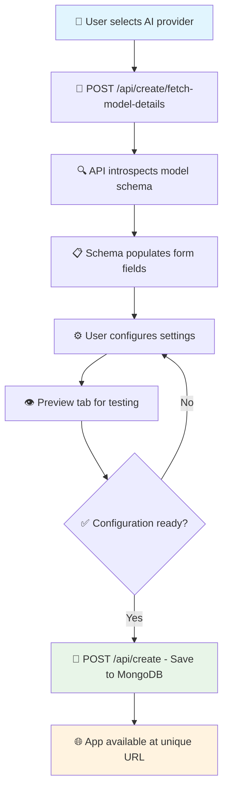
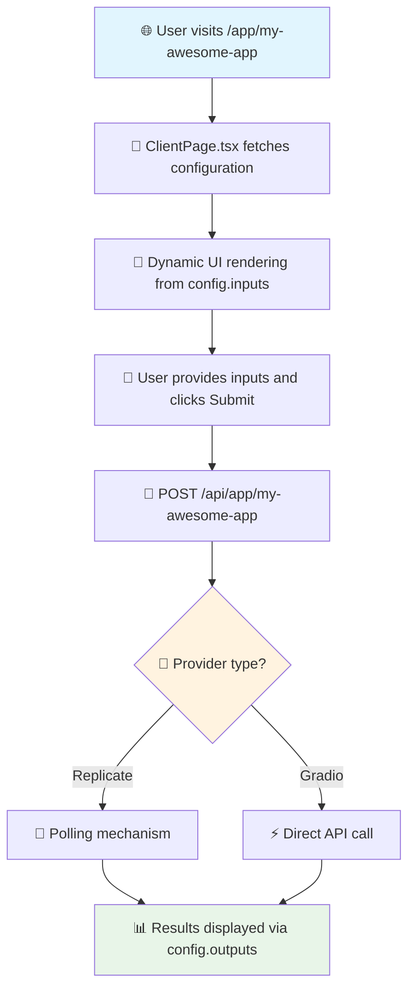
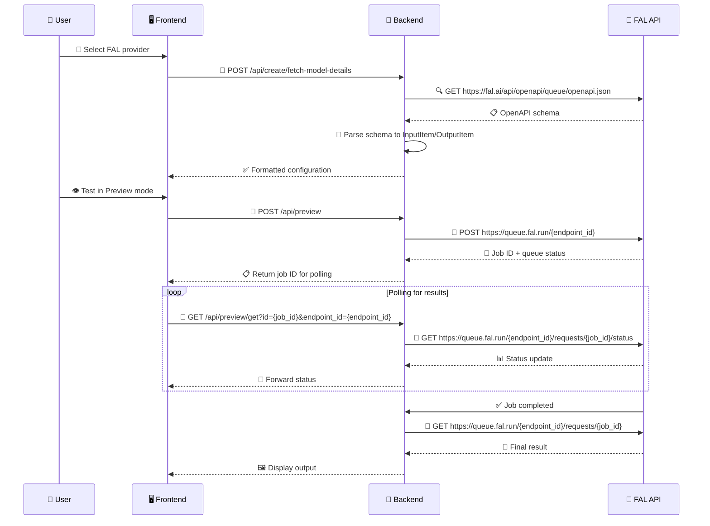
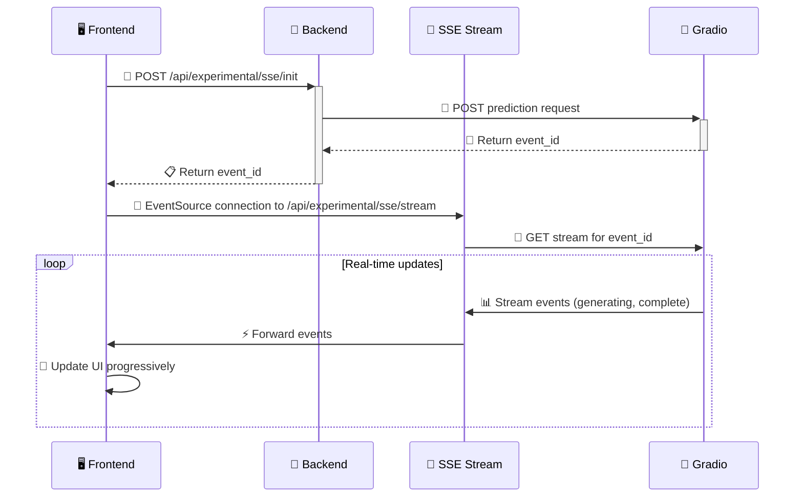

# 🚀 AI App Generation Platform

[](https://nextjs.org/)
[](https://www.typescriptlang.org/)
[](https://tailwindcss.com/)
[](https://www.mongodb.com/)

> **🎯 A powerful low-code platform for rapidly building and deploying AI model interfaces**

---

## 📋 Table of Contents

- [💡 Project Overview](#-project-overview)
- [✨ Core Features](#-core-features)
- [🛠️ Technology Stack](#️-technology-stack)
- [🏗️ Architecture Workflows](#️-architecture-workflows)
- [💻 Code Examples](#-code-examples)
- [⚡ Experimental Features](#-experimental-features)

---

## 💡 Project Overview

This Next.js project is a **powerful and ambitious platform** designed to rapidly build and deploy web interfaces for AI models. The core goal is to abstract away the repetitive work of creating frontends for AI services like **Replicate** and **Gradio**.

### 🎯 **Mission Statement**
> Transform AI model integration from hours of development into minutes of configuration

By defining an application through a **JSON configuration**, the platform can automatically generate a complete, interactive UI, which is then saved to a MongoDB database and made available at a unique URL.

This system effectively functions as a **low-code AI app builder**, enabling developers to:
- 🚀 Quickly prototype AI applications
- ✅ Validate ideas with minimal effort  
- 📦 Deploy a portfolio of AI tools instantly

---

## ✨ Core Features

<table>
<tr>
<td width="50%">

### 🎨 **Dynamic App Creation**
A dedicated UI (`/create`) allows users to define new applications by specifying an AI provider and model identifier.

### 🔍 **Automatic Schema Introspection**
The system fetches API schemas from providers to automatically populate input/output fields, simplifying configuration.

### ⚙️ **Configuration-Driven UI**
Applications are defined by a Configuration object. The frontend dynamically renders UI components based on this object.

</td>
<td width="50%">

### 👁️ **Live App Preview**
Interactive "Preview" tab (`AppPreview.tsx`) allows real-time testing of configurations before saving.

### 🔌 **Multi-Provider Support**
Seamlessly integrates with **Replicate** (polling-based), **Gradio** (direct API calls), and **FAL** (queue-based processing).

### 💾 **Database Integration**
App configurations are persisted in MongoDB for scalable, dynamic app libraries.

</td>
</tr>
</table>

### 🧪 **Experimental Features**
- **⚡ Real-time Updates (SSE)**: Server-Sent Events implementation for Gradio models
- **📊 Progress Tracking**: Real-time progress updates instead of traditional polling

---

## 🛠️ Technology Stack

### 🎨 **Frontend Technologies**
| Category | Technology | Purpose |
|----------|------------|---------|
| **Framework** | Next.js 14 (App Router) | Modern React framework with server-side rendering |
| **Language** | TypeScript | Type-safe development |
| **Styling** | Tailwind CSS | Utility-first CSS framework |
| **UI Components** | React, Headless UI, React Dropzone | Interactive user interface |

### 🔧 **Backend Technologies**
| Category | Technology | Purpose |
|----------|------------|---------|
| **API Routes** | Next.js API Routes | Server-side logic and endpoints |
| **Database** | MongoDB | Configuration storage and retrieval |
| **AI/ML Clients** | replicate, @gradio/client, FAL API | AI model integration |
| **Real-time** | EventSource (SSE) | Live updates and streaming |

---

## 🏗️ Architecture Workflows

### 1️⃣ **App Creation Flow** (`/create`)



**📝 Detailed Steps:**
1. **🎯 Select Provider & Fetch Details**: User chooses Replicate/Gradio/FAL and enters model identifier
2. **🔍 Introspect Schema**: API connects to provider, fetches model schema (inputs, outputs, defaults)
3. **⚙️ Configure & Preview**: Form population with editing capabilities and live preview testing
4. **💾 Save to Database**: Final configuration saved to MongoDB, making app accessible

### 2️⃣ **Dynamic App Execution** (`/app/[slug]`)



**📝 Detailed Steps:**
1. **📄 Fetch Configuration**: Component retrieves config object for the slug
2. **🎨 Render Dynamic UI**: Iteration through `config.inputs` array for component rendering
3. **⚡ Execute Prediction**: POST request to dynamic API endpoint
4. **🔄 Process & Return**: Backend executes prediction (polling for Replicate, direct for Gradio)
5. **📊 Display Output**: Results shown using `config.outputs` components

---

## 💻 Code Examples

### 1️⃣ **Core Configuration Type**

> 📁 **File**: `src/types/index.ts`

The entire system is powered by a central **Configuration** type that defines everything needed to render an app and connect it to an AI model.

```typescript
// 🎨 Defines the UI component and properties for an input field
export type InputItem = {
  component: 'image' | 'prompt' | 'checkbox' | 'number' | 'video' | 'Textbox' | 'dropdown' | 'slider' | 'audio' | 'checkboxgroup';
  key: string;          // 🔑 The name of the parameter for the API call
  type: 'string' | 'array' | 'integer' | 'boolean';
  show?: boolean;       // 👁️ Whether to display this input in the UI
  label?: string;       // 🏷️ The display label for the input
  value?: any;          // 💾 Default value for hidden inputs
  required?: boolean;   // ⚠️ Required field validation
};

// 📊 Defines the UI component and properties for an output display
export interface OutputItem {
  component: 'image' | 'prompt' | 'checkbox' | 'number' | 'video' | 'audio' | 'textbox';
  key: string;
  type: 'string' | 'number' | 'boolean' | 'array';
  show: boolean;
  title?: string;
}

// 🎯 The main configuration object for an app
export type Configuration = {
  name: string;                                 // 🏷️ The app's unique name (used as the URL slug)
  type: 'gradio' | 'replicate';                 // 🔌 The AI provider
  client?: string;                              // 📡 For Gradio: the client path (e.g., 'user/repo')
  endpoint?: string;                            // 🎯 For Gradio: the specific API endpoint to call
  model?: `${string}/${string}` | `${string}/${string}:${string}`; // 🤖 For Replicate: the model identifier
  version?: string | null;                      // 📌 For Replicate: the model version hash
  inputs: InputItem[];
  outputs?: OutputItem[];
};
```

### 2️⃣ **Dynamic API Route for Predictions**

> 📁 **File**: `src/app/api/app/[slug]/route.ts`

This backend route is the **engine** that runs predictions for all dynamically created apps. It intelligently looks up the app's configuration by its slug and calls the correct AI provider.

```typescript
import { NextResponse } from 'next/server';
import Replicate from 'replicate';
import { getConfigurations } from '@/common/configuration';
import { Client } from "@gradio/client";

export async function POST(
  request: Request,
  { params }: { params: { slug: string } },
) {
  const slug = params.slug;
  
  try {
    // 1️⃣ Fetch all configurations and find the one matching the slug
    const configurations = await getConfigurations(true);
    const config = configurations.find(conf => conf.name === slug);

    if (!config) {
      return NextResponse.json(
        { error: `Config not found for slug: ${slug}` }, 
        { status: 404 }
      );
    }

    const req = await request.json();

    // 2️⃣ Branch logic based on the provider type
    if (config.type === 'replicate') {
      const replicate = new Replicate({ auth: process.env.REPLICATE_API_TOKEN });
      const input = { /* ... construct input object from request ... */ };

      // 🚀 Start the prediction and return an ID for polling
      const output = await replicate.predictions.create({
        model: config.model,
        version: config.version,
        input,
      });
      return NextResponse.json(output, { status: 201 });

    } else if (config.type === 'gradio') {
      const app = await Client.connect(config.client as string);
      const params = { /* ... construct params object from request ... */ };

      // ⚡ Directly call the Gradio endpoint and return the result
      const output = await app.predict(config.endpoint as string, params);
      return NextResponse.json(
        { status: 'succeeded', output: output.data }, 
        { status: 201 }
      );
    }

  } catch (error: any) {
    console.error("API error for slug " + slug + ": " + error.message);
    return NextResponse.json({ error: error.message }, { status: 500 });
  }
}
```

### 3️⃣ **Dynamic UI Rendering on the Frontend**

> 📁 **File**: `src/app/app/[slug]/ClientPage.tsx`

The **ClientPage.tsx** component brings the configuration to life by rendering the UI dynamically. It maps over the `config.inputs` array to generate the form.

```typescript
// 📦 ... (imports and state hooks)

export default function ClientPage({ slug, initialConfigurations }) {
  // 🔄 ... (state logic for loading, config, inputs, outputs)

  // 🎯 Fetch the specific config for the current slug
  const [config, setConfig] = useState<Configuration | null>(null);
  useEffect(() => {
    const foundConfig = initialConfigurations.find(conf => conf.name === slug);
    setConfig(foundConfig);
  }, [slug, initialConfigurations]);

  if (!config) { 
    return <div>⏳ Loading configuration...</div>; 
  }

  return (
    <main>
      {/* 🎛️ ... (ActionPanel, ErrorNotification) */}
      <div className="grid grid-cols-2 gap-8">
        {/* 📥 Input Section */}
        <div>
          <h1>📥 Input</h1>
          {/* 🔄 Loop through inputs from the config to render components */}
          {config.inputs.map((item: InputItem, index: number) => {
            if (item.show) {
              switch (item.component.toLowerCase()) {
                case 'image':
                  return <ImageDropzone key={index} {...item} onImageDrop={onImageDrop} />;
                case 'prompt':
                case 'textbox':
                  return <Prompt key={index} {...item} setPrompt={setPrompt} />;
                case 'slider':
                  return <Slider key={index} {...item} onChange={/*...*/} />;
                // 🎨 ... other cases for different components
                default:
                  return <div key={index}>❌ Unsupported component: {item.component}</div>;
              }
            }
            return null;
          })}
        </div>

        {/* 📤 Output Section */}
        <div>
          <h1>📤 Output</h1>
            {/* 🔄 Loop through outputs to render placeholders or results */}
            {config.outputs?.map((item: OutputItem, index: number) => {
              if (item.show) {
                // 🎨 ... render output components (ImageOutput, VideoOutput, etc.)
              }
              return null;
            })}
        </div>
      </div>
    </main>
  );
}
```

---

## 🚀 FAL Integration & Multi-Provider Architecture

### 🎯 **Latest Addition: FAL Support**

The platform now supports **FAL (Fast AI Labs)** as a third AI provider, bringing advanced models like FLUX Pro to the platform. This integration showcases the system's extensibility and provider-agnostic design.

### 🔧 **Provider-Specific Base URLs & Architecture**

Each AI provider uses its own base URL and authentication system:

| Provider | Base URL | Authentication | Processing Model |
|----------|----------|----------------|------------------|
| **🔄 Replicate** | `api.replicate.com` | Bearer Token | Async polling |
| **⚡ Gradio** | Dynamic (e.g., `user-repo.hf.space`) | None/API Key | Direct response |
| **🚀 FAL** | `queue.fal.run` | API Key | Queue-based processing |

### 🏗️ **FAL Integration Architecture**



### 4️⃣ **FAL Schema Introspection**

> 📁 **File**: `src/app/api/create/fetch-model-details/route.ts`

The system automatically fetches FAL's OpenAPI schema and converts it to our internal format:

```typescript
// 🔍 FAL Schema Fetching
if (type === 'fal') {
  // Fetch OpenAPI schema from FAL
  const response = await fetch(`https://fal.ai/api/openapi/queue/openapi.json?endpoint_id=${endpoint_id}`);
  const schema = await response.json();
  
  // Extract input/output schemas
  const inputSchema = schema.components.schemas[`${modelName}Input`];
  const outputSchema = schema.components.schemas[`${modelName}Output`];
  
  // 🎨 Convert to our InputItem format
  const inputs = Object.entries(inputSchema.properties).map(([key, value]) => ({
    component: mapFALTypeToComponent(value.type, key), // 🔄 Smart component mapping
    key,
    type: value.type,
    value: value.default || null,
    show: !value.default, // Hide fields with defaults
    placeholder: value.description,
    label: value.title || key,
    required: inputSchema.required?.includes(key) || false
  }));
  
  return NextResponse.json({ inputs, outputs, endpoint_id });
}

// 🎯 Smart component mapping based on field names and types
function mapFALTypeToComponent(type: string, fieldName: string) {
  if (fieldName.includes('image') || fieldName.includes('url')) return 'image';
  if (type === 'boolean') return 'checkbox';
  if (type === 'number' || type === 'integer') return 'number';
  return 'prompt'; // Default to text input
}
```

### 5️⃣ **Provider-Aware Polling System**

> 📁 **File**: `src/components/AppPreview.tsx`

The frontend now intelligently routes polling requests to the correct provider:

```typescript
// 🔄 Provider-aware polling in AppPreview
const handleSubmitPreview = async () => {
  // ... (input validation and processing)
  
  const response = await fetch('/api/preview', {
    method: 'POST',
    body: JSON.stringify({ config, params })
  });
  
  const responseData = await response.json();
  
  if (responseData.id) {
    let status = null;
    do {
      await sleep(1000);
      
      // 🎯 Build provider-specific polling URL
      let pollUrl = `/api/preview/get?id=${responseData.id}`;
      
      // For FAL: Include endpoint_id for proper routing
      if (config.type === 'fal' && config.endpoint_id) {
        pollUrl += `&endpoint_id=${config.endpoint_id}`;
      }
      
      const result = await fetch(pollUrl).then(r => r.json());
      status = result.status;
    } while (status !== 'succeeded' && status !== 'failed');
  }
};
```

### 🆕 **Updated Configuration Type**

The Configuration type now supports all three providers:

```typescript
export type Configuration = {
  name: string;
  type: 'gradio' | 'replicate' | 'fal';  // 🆕 Added FAL support
  
  // Provider-specific fields
  client?: string;                        // 📡 Gradio: client path
  endpoint?: string;                      // 🎯 Gradio: API endpoint
  model?: `${string}/${string}`;          // 🤖 Replicate: model identifier  
  version?: string | null;                // 📌 Replicate: version hash
  endpoint_id?: string;                   // 🚀 FAL: endpoint identifier
  
  inputs: InputItem[];
  outputs?: OutputItem[];
};
```

### 🎯 **Key Architectural Improvements**

1. **🔗 Provider Abstraction**: Each provider has its own base URL and request format
2. **🧠 Smart Schema Parsing**: Automatic conversion from OpenAPI to UI components  
3. **🔄 Unified Polling**: Single interface that routes to provider-specific endpoints
4. **⚙️ Component Mapping**: Intelligent field-to-component mapping (e.g., `image_url` → image uploader)
5. **🎨 Live Preview**: Real-time testing across all providers before saving

### 🚀 **Supported FAL Models**
- **FLUX Pro/Kontext**: Advanced image generation with context understanding
- **FLUX Schnell**: Fast image generation for rapid prototyping  
- **FLUX Dev**: High-quality image generation for production use
- **Realism Models**: Photo-realistic image generation

---

## ⚡ Experimental Features

### 🌊 **Server-Sent Events (SSE) for Gradio**

The project includes an **advanced feature** for real-time updates from Gradio, providing a more responsive user experience for long-running predictions.

> 📋 **From**: `docs/sse-implementation.md`



### 🎯 **Key Benefits**
- **⚡ Real-time Progress**: Live updates instead of polling
- **📈 Better UX**: Progressive UI updates during long-running tasks
- **🔋 Efficient**: Reduces unnecessary API calls
- **🔧 Well-documented**: Experimental but thoroughly implemented

---

## 🚀 Quick Start

1. **📦 Install Dependencies**
   ```bash
   npm install
   ```

2. **⚙️ Set Environment Variables**
   ```bash
   cp .env.example .env.local
   # Configure your API keys
   ```

3. **🗄️ Setup Database**
   ```bash
   # Configure MongoDB connection
   ```

4. **🚀 Run Development Server**
   ```bash
   npm run dev
   ```

5. **🎨 Create Your First AI App**
   - Navigate to `/create`
   - Select an AI provider
   - Configure your model
   - Preview and deploy!

---

<div align="center">

**🎉 Ready to build the future of AI interfaces? Let's get started! 🚀**

*Built with ❤️ using Next.js, TypeScript, and modern web technologies*

</div>
