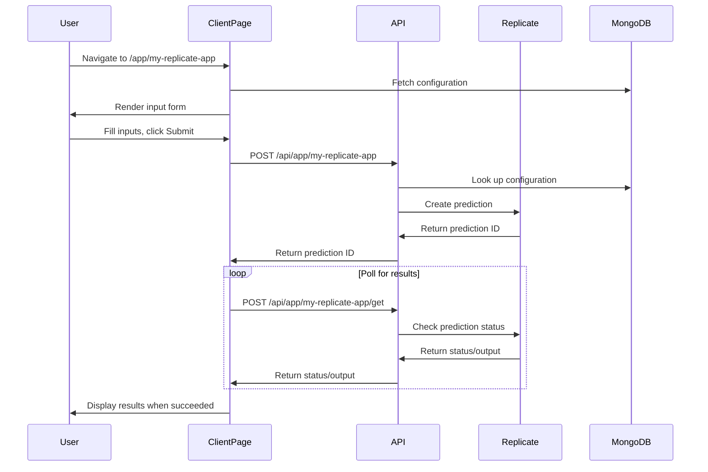
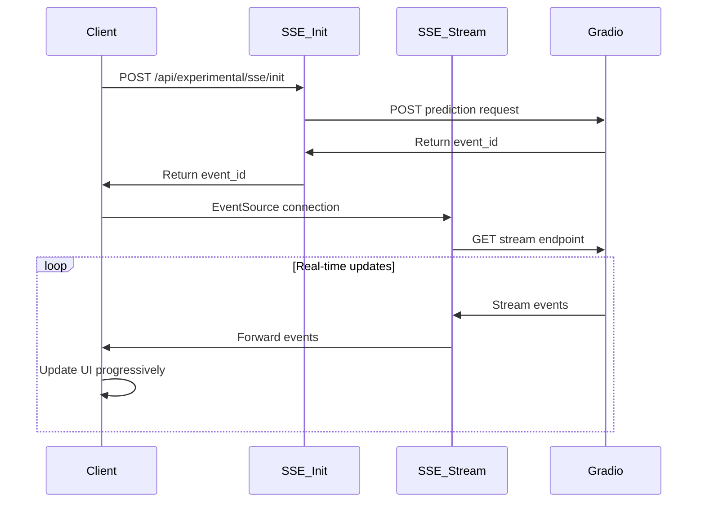

# AI App Generation Platform (Project "changebg")

## Table of Contents
- [Overview](#overview)
- [Architecture](#architecture)
- [Core Features & Modules](#core-features--modules)
- [Key Technologies & Libraries](#key-technologies--libraries)
- [Directory Structure](#directory-structure)
- [Important Files & Their Roles](#important-files--their-roles)
- [API Endpoints](#api-endpoints)
- [Data Flow Examples](#data-flow-examples)
- [Code Examples](#code-examples)
- [Future/Experimental Features](#futureexperimental-features)
- [Notes & Potential Improvements](#notes--potential-improvements)

## Overview

This Next.js project serves as a platform for rapidly creating and deploying web applications that interface with AI models, primarily from **Replicate** and **Gradio**. The core concept is to define an "app" via a configuration (specifying inputs, outputs, and backend model details), store this configuration, and then dynamically render a UI for users to interact with the AI model.

### Key Functionalities

- **Dynamic App Creation**: Users can define new "apps" through a UI or JSON configuration
- **Dynamic App Rendering**: Generated apps are accessible via unique slugs (`/app/[slug]`)
- **AI Model Integration**: Supports both Replicate and Gradio models
- **App Preview**: Allows testing configurations before saving
- **Server-Sent Events (SSE)**: Experimental support for real-time updates from Gradio
- **Database Storage**: MongoDB for storing app configurations
- **Pre-built Tools**: Several standalone AI tools (IlluminAI, Upscaler, etc.)

## Architecture

- **Frontend**: Next.js (App Router), React, Tailwind CSS
- **Backend**: Next.js API Routes
- **Database**: MongoDB
- **AI Model Providers**:
  - Replicate (via `replicate` npm package and direct API calls)
  - Gradio (via `@gradio/client` npm package and direct API calls, including SSE)

## Core Features & Modules

### 3.1. App Creation & Configuration

**UI Components:**
- Main UI: `/create` (`src/app/create/page.tsx`)
- Preview Component: `src/components/AppPreview.tsx`

**API Endpoints:**
- `POST /api/create` - Save configurations (`src/app/api/create/route.ts`)
- `GET /api/create/get` - Fetch configurations (`src/app/api/create/get/route.ts`)
- `POST /api/create/fetch-model-details` - Model schema introspection (`src/app/api/create/fetch-model-details/route.ts`)

**Data Storage:**
- MongoDB integration via `src/lib/mongodb.ts`
- Configuration schema defined in `src/types/index.ts` (InputItem, OutputItem, Configuration)

#### Workflow

1. **Navigation**: User navigates to `/create`
2. **Model Selection**: User selects app type (Replicate/Gradio) and provides model/client details
3. **Schema Fetching**: 
   - For **Replicate**: Fetches model schema from `https://api.replicate.com/v1/models/{model}/versions/{version}`
   - For **Gradio**: Uses `@gradio/client`'s `Client.connect(client).view_api()` or fetches from `{gradio_space_url}/info`
4. **Configuration**: Fetched schema populates input/output fields, user can edit properties
5. **Preview/Edit**: User can switch between "Form" and "JSON" views
6. **Save**: Final configuration is submitted and saved to MongoDB

#### Configuration Merging

- `src/common/configuration.ts` defines `configurationsObj` (hardcoded configurations)
- `getConfigurations(forceRefresh?: boolean)` merges database configurations with hardcoded ones
- This serves as the primary source of app definitions for the entire application

### 3.2. Dynamic App Rendering

**Components:**
- Page Template: `/app/[slug]` (`src/app/app/[slug]/page.tsx` and `ClientPage.tsx`)

**API Endpoints:**
- `POST /api/app/[slug]` - Execute predictions (`src/app/api/app/[slug]/route.ts`)
- `POST /api/app/[slug]/get` - Status check for Replicate (`src/app/api/app/[slug]/get/route.ts`)

#### Workflow

1. **Page Load**: User navigates to `/app/[slug]`
2. **Server Component**: Fetches `initialConfigurations` using `getConfigurations()`
3. **Client Component**: `ClientPage.tsx` renders dynamic UI based on configuration
4. **Input Handling**: User provides inputs (text, file uploads converted to base64)
5. **Prediction Execution**:
   - **Replicate**: Creates prediction, returns prediction ID, polls for results
   - **Gradio**: Executes prediction directly, returns immediate results
6. **Results Display**: Updates UI with outputs based on `config.outputs`

### 3.3. App Preview Feature

**Integration**: Within `/create` page via "Preview" tab
**Component**: `src/components/AppPreview.tsx`
**API Endpoints:**
- `POST /api/preview` - Preview predictions (`src/app/api/preview/route.ts`)
- `GET /api/preview/get` - Preview status check (`src/app/api/preview/get/route.ts`)

#### Workflow

1. **Preview Mode**: User selects "Preview" tab in `/create`
2. **Dynamic Rendering**: `AppPreview.tsx` renders inputs based on current draft config
3. **Testing**: User interacts with inputs and clicks "Test Configuration"
4. **Execution Options**:
   - **SSE Enabled**: For Gradio with experimental SSE support
   - **Standard**: Uses preview API endpoints for polling-based results
5. **Results**: Displays outputs based on configuration

### 3.4. Server-Sent Events (SSE) for Gradio (Experimental)

**Documentation**: `docs/sse-implementation.md`
**API Endpoints:**
- `POST /api/experimental/sse/init` - Initiate SSE prediction
- `GET /api/experimental/sse/stream` - Stream SSE data
**Utilities**: `src/utils/gradio.ts`

#### Workflow

1. **Initiation**: `AppPreview.tsx` sends POST to `/api/experimental/sse/init`
2. **Event ID**: Gradio API returns an `event_id`
3. **Stream Connection**: Client creates EventSource to `/api/experimental/sse/stream`
4. **Real-time Updates**: Server pipes Gradio stream directly to client
5. **Event Handling**: Client listens for messages and updates UI progressively

### 3.5. Static/Specific Tools

Pre-defined applications with dedicated pages and API routes:

| Tool | UI Route | API Route | Model |
|------|----------|-----------|--------|
| IlluminAI | `/illuminai` | `POST /api/illuminai` | `zsxkib/ic-light` |
| Upscaler | `/upscaler` | `POST /api/upscale` | `philz1337x/clarity-upscaler` |
| Remove Background | `/removebg` | `POST /api/removebg` | `codeplugtech/background_remover` |
| Enhance Background | `/enhancebg` | `POST /api/enhancebg` | Various models |
| Simpson | `/simpson` | `POST /api/simpson` | Simpson-style generation |
| Interior Design | `/` (homepage) | `POST /api/inter-design` | Interior design models |

## Key Technologies & Libraries

### Core Framework
- **Next.js 14+** (App Router)
- **React 18**
- **TypeScript**
- **Tailwind CSS**

### AI Integration
- **Replicate Client** (`replicate` npm) - Replicate model interactions
- **Gradio Client** (`@gradio/client` npm) - Gradio space/API interactions

### Database & Storage
- **MongoDB** (`mongodb` npm) - Configuration storage

### UI Components & Utilities
- **React Dropzone** (`react-dropzone` npm) - File uploads
- **FileSaver.js** (`file-saver` npm) - Client-side downloads
- **React Loader Spinner** - Loading indicators
- **Axios** - HTTP requests (alongside native `fetch`)

### Icons & Styling
- **Heroicons**
- **Lucide React**
- **React Icons**

### Experimental Features
- **EventSource Polyfill** (`eventsource` npm) - SSE support

## Directory Structure

```
src/
├── app/                          # Next.js App Router
│   ├── (pages)/                  # Main UI pages
│   ├── app/[slug]/              # Dynamic app rendering
│   ├── api/                     # Backend API routes
│   │   ├── app/[slug]/          # Dynamic app APIs
│   │   ├── create/              # App creation APIs
│   │   ├── experimental/sse/    # SSE APIs
│   │   └── [tool-apis]/         # Specific tool APIs
│   └── create/                  # App creation UI
├── common/                      # Shared configurations
│   ├── configuration.ts         # Central app definitions
│   └── index.ts                 # Navigation items
├── components/                  # Reusable React components
├── lib/                         # Utility modules
│   └── mongodb.ts              # MongoDB connection
├── types/                       # TypeScript definitions
├── utils/                       # General utilities
└── experimental/sse-handler/    # SSE placeholder files

docs/                            # Project documentation
playground/                      # Testing scripts
public/                         # Static assets
```

## Important Files & Their Roles

| File | Purpose |
|------|---------|
| `src/common/configuration.ts` | Central logic for app definitions, merges hardcoded configs with DB-fetched ones |
| `src/app/create/page.tsx` | UI for creating new app configurations |
| `src/app/api/create/fetch-model-details/route.ts` | Backend logic to get schema/info from Replicate/Gradio |
| `src/app/app/[slug]/ClientPage.tsx` | Renders UI for dynamically configured apps |
| `src/app/api/app/[slug]/route.ts` | Backend logic for running predictions for dynamic apps |
| `src/components/AppPreview.tsx` | Real-time app preview component during creation |
| `src/app/api/preview/route.ts` | Backend logic for handling preview requests |
| `src/app/api/experimental/sse/init/route.ts` | SSE initiation for Gradio |
| `src/app/api/experimental/sse/stream/route.ts` | SSE streaming for Gradio |
| `src/types/index.ts` | Defines `Configuration`, `InputItem`, `OutputItem` types |

## API Endpoints

### Core Endpoints

| Method | Endpoint | Purpose |
|--------|----------|---------|
| `POST` | `/api/create` | Create new app configuration in MongoDB |
| `GET` | `/api/create/get` | Fetch all app configurations |
| `POST` | `/api/create/fetch-model-details` | Fetch schema/info for Replicate/Gradio models |
| `POST` | `/api/app/[slug]` | Run prediction for app identified by slug |
| `POST` | `/api/app/[slug]/get` | Get status/result of Replicate prediction |
| `POST` | `/api/preview` | Run prediction in preview mode |
| `GET` | `/api/preview/get` | Get status/result for preview prediction |

### Experimental Endpoints

| Method | Endpoint | Purpose |
|--------|----------|---------|
| `POST` | `/api/experimental/sse/init` | Initiate SSE-based Gradio prediction |
| `GET` | `/api/experimental/sse/stream` | Stream Gradio prediction events |

### Tool-Specific Endpoints

| Method | Endpoint | Purpose |
|--------|----------|---------|
| `POST` | `/api/illuminai` | IlluminAI tool prediction |
| `POST` | `/api/upscale` | Image upscaling |
| `POST` | `/api/removebg` | Background removal |
| `POST` | `/api/enhancebg` | Background enhancement |
| `POST` | `/api/simpson` | Simpson-style generation |
| `POST` | `/api/inter-design` | Interior design generation |

## Data Flow Examples

### Dynamic App Execution (Replicate)



### SSE-Based Gradio Execution



## Code Examples

### Replicate Prediction (from `src/app/api/app/[slug]/route.ts`)

```typescript
// Inside POST /api/app/[slug] when config.type === 'replicate'
const replicate = new Replicate({ auth: REPLICATE_API_TOKEN });
const model: `${string}/${string}` | `${string}/${string}:${string}` | undefined = config.model;
const version = config.version as string | undefined;
const input: { [key: string]: any } = {}; // Constructed from req and config.inputs

// ... logic to populate 'input' object ...

const output = await replicate.predictions.create({
  model,
  version,
  input,
});
return NextResponse.json(output, { status: 201 });
```

### Configuration Type Definition

```typescript
interface Configuration {
  name: string;
  type: 'replicate' | 'gradio';
  model?: string;
  version?: string;
  client?: string;
  endpoint?: string;
  inputs: InputItem[];
  outputs: OutputItem[];
}

interface InputItem {
  name: string;
  type: string;
  component: string;
  show: boolean;
  label: string;
  defaultValue?: any;
  // ... additional properties
}

interface OutputItem {
  name: string;
  type: string;
  component: string;
  show: boolean;
  label: string;
}
```

## Future/Experimental Features

### SSE Implementation
- **Status**: Experimental
- **Purpose**: Provide real-time progress updates instead of polling
- **Target**: Gradio models with streaming support
- **Documentation**: `docs/sse-implementation.md`

### Vision & Roadmap
According to `productSpec.md`, the project has ambitious goals including:
- AI assembly capabilities
- No-code AI platform
- Super agentic workflows
- Enhanced user experience for AI interaction

## Notes & Potential Improvements

### Security Considerations
- ✅ **API Keys**: Properly managed via environment variables
- ⚠️ **Input Validation**: Could be enhanced across API routes
- ⚠️ **Rate Limiting**: Not currently implemented

### Code Quality
- **Shared Logic**: `ClientPage.tsx` and `AppPreview.tsx` could benefit from more shared components
- **Error Handling**: Present but could be more standardized
- **TypeScript**: Well-typed throughout the application

### Performance
- **Caching**: `getConfigurations()` uses 3600s revalidation with cache-busting support
- **File Handling**: Base64 conversion for files could be optimized for large uploads
- **Database**: MongoDB queries could benefit from indexing strategies

### Architecture
- **Separation of Concerns**: Clear separation between static tools and dynamic apps
- **Modularity**: Good component structure with reusable elements
- **Scalability**: Current architecture supports adding new AI providers

### Development Experience
- **Documentation**: Well-documented with inline comments and separate docs
- **Testing**: `playground/` directory provides good examples for testing integrations
- **Debugging**: SSE implementation includes comprehensive error handling

### Known Limitations
- **File Size**: Large file uploads may face browser/server limits with base64 encoding
- **SSE Support**: Currently experimental and limited to Gradio
- **Model Discovery**: Manual model configuration required (no automatic discovery)
- **Preview Isolation**: Uses `X-Preview-Mode` header concept but implements via separate endpoints

This documentation provides a comprehensive overview of the AI App Generation Platform, serving as both a technical reference and architectural guide for developers working with the system.
